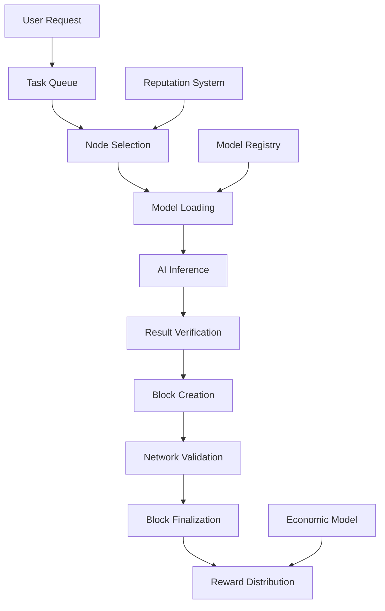

<!--
Copyright (c) 2025-present Cesar Saguier Antebi

This file is part of AIGEN Blockchain.

This source code is licensed under the Business Source License 1.1
found in the LICENSE file in the root directory of this source tree.
-->

# Proof-of-Intelligence: AIGEN's Revolutionary Consensus Mechanism

## Executive Summary

Proof-of-Intelligence (PoI) is an emerging consensus mechanism that redirects computational resources from wasteful cryptographic puzzles toward valuable artificial intelligence tasks. While the concept of PoI has been discussed in academic and industry circles, AIGEN introduces the first production-ready implementation that seamlessly integrates AI inference directly into blockchain consensus. This whitepaper explores the evolution of PoI, AIGEN's unique innovations, and how our implementation advances the state of the art in decentralized AI.

## Table of Contents

1. [Introduction](#1-introduction)
2. [The Evolution of Consensus Mechanisms](#2-the-evolution-of-consensus-mechanisms)
3. [Existing PoI Concepts and Limitations](#3-existing-poi-concepts-and-limitations)
4. [AIGEN's PoI Innovation](#4-aigens-poi-innovation)
5. [Technical Architecture](#5-technical-architecture)
6. [Economic Model](#6-economic-model)
7. [Security Analysis](#7-security-analysis)
8. [Comparative Analysis](#8-comparative-analysis)
9. [Future Roadmap](#9-future-roadmap)
10. [Conclusion](#10-conclusion)

## 1. Introduction

### 1.1 The Problem with Traditional Consensus

Blockchain consensus mechanisms have evolved significantly since Bitcoin's Proof-of-Work (PoW), but each has fundamental limitations:

- **PoW**: Energy-intensive computation with no real-world value
- **PoS**: Capital-based consensus that doesn't contribute to society
- **DPoS**: Centralization risks through delegation
- **PoUW**: Limited scope and specialized requirements

### 1.2 The Promise of PoI

Proof-of-Intelligence represents a paradigm shift where the computational work required to secure a blockchain produces valuable AI outputs. Instead of solving arbitrary mathematical puzzles, nodes perform AI inference tasks that have real-world utility.

### 1.3 AIGEN's Contribution

While PoI has been conceptualized in academic papers and discussed by various projects, AIGEN delivers the first comprehensive implementation that:

1. **Integrates AI inference directly into consensus**
2. **Supports multiple AI models and use cases**
3. **Provides economic incentives for all participants**
4. **Maintains security and decentralization**
5. **Offers production-ready deployment**

## 2. The Evolution of Consensus Mechanisms

### 2.1 First Generation: Proof-of-Work (2009)

**Bitcoin's Innovation:**
- Computational puzzles for security
- Decentralized consensus
- Energy consumption as security feature

**Limitations:**
- Massive energy waste
- No real-world output
- Specialized hardware requirements
- Environmental concerns

### 2.2 Second Generation: Proof-of-Stake (2012)

**Ethereum's Evolution:**
- Capital-based consensus
- Energy efficiency
- Economic security through staking

**Limitations:**
- No productive output
- Wealth concentration risks
- Complex governance requirements

### 2.3 Third Generation: Useful Work Consensus

**Proof-of-Useful-Work (PoUW):**
- Academic concepts since 2017
- Focus on machine learning training
- Limited to specific computational tasks

**Challenges:**
- Specialized hardware requirements
- Limited task scope
- Centralization tendencies

## 3. Existing PoI Concepts and Limitations

### 3.1 Academic Research

#### Early Papers (2017-2021)
Academic papers introduced PoI concepts focusing on:
- ML model training for consensus
- Neural network inference tasks
- Computational intelligence contributions

**Limitations Identified:**
- Theoretical frameworks only
- No production implementations
- Limited scalability analysis
- Specialized hardware requirements

#### Recent Developments (2022-2024)
Recent research has addressed:
- Energy efficiency comparisons
- Security analysis frameworks
- Economic modeling approaches

**Remaining Challenges:**
- Lack of practical implementations
- Limited model diversity
- Centralization concerns
- Economic sustainability questions

### 3.2 Industry Implementations

#### aelf Blockchain (2023)
- **Concept**: PoI for AI agent development
- **Focus**: AI training and optimization
- **Status**: Conceptual stage, limited deployment

**Limitations:**
- Primarily focused on AI agents
- Limited inference capabilities
- Centralized development model
- No broad model support

#### Other Projects
Various projects have claimed PoI implementation but suffer from:
- **Limited Scope**: Single model or task focus
- **Centralization**: Control by founding teams
- **Technical Debt**: Incomplete implementations
- **Economic Issues**: Unsustainable tokenomics

### 3.3 The Gap in the Market

Despite growing interest in PoI, no existing project provides:

1. **Production-ready infrastructure** for diverse AI models
2. **Economic sustainability** through real-world usage
3. **True decentralization** with broad participation
4. **Comprehensive security** model
5. **Scalable architecture** for global deployment

## 4. AIGEN's PoI Innovation

### 4.1 Our Unique Approach

AIGEN's PoI implementation represents a fundamental advancement in several key areas:

#### 4.1.1 Direct Consensus Integration
Unlike approaches that layer AI on top of existing consensus, AIGEN embeds AI inference directly into the block production process:

```
Traditional PoI:
Block Production → AI Task (Separate) → Rewards

AIGEN PoI:
AI Task → Block Production → Rewards (Integrated)
```

#### 4.1.2 Multi-Model Support
AIGEN supports diverse AI models:
- **Language Models**: Mistral-7B, LLaMA-13B, CodeGen-16B
- **Custom Models**: User-deployed models via governance
- **Future Models**: Emerging architectures and capabilities

#### 4.1.3 Economic Realignment
Our economic model aligns incentives across:
- **Users**: Affordable AI services
- **Developers**: Fair compensation for models
- **Node Operators**: Sustainable rewards
- **Network**: Long-term value creation

### 4.2 Technical Innovations

#### 4.2.1 Sharded Model Architecture
- **Problem**: Large AI models are difficult to distribute
- **Solution**: Intelligent sharding with redundant storage
- **Benefit**: Efficient distribution and retrieval

#### 4.2.2 Dynamic Task Allocation
- **Problem**: Static task assignment leads to inefficiency
- **Solution**: AI-powered task scheduling based on:
  - Node capabilities
  - Model availability
  - User demand
  - Network conditions

#### 4.2.3 Verifiable Computation
- **Problem**: How to trust AI inference results
- **Solution**: Multi-layer verification:
  - Cryptographic proofs
  - Consensus validation
  - Reputation systems
  - Economic incentives

### 4.3 Economic Innovations

#### 4.3.1 Dual-Token Economy
- **AIGEN Token**: Network utility and governance
- **Computation Credits**: Specific to AI tasks
- **Conversion Mechanism**: Flexible economic model

#### 4.3.2 Subscription + Pay-per-Use
- **Base Layer**: Subscription for predictable costs
- **Usage Layer**: Pay-per-use for additional needs
- **Market Dynamics**: Supply-demand based pricing

#### 4.3.3 Fair Revenue Distribution
- **Model Creators**: 20% of inference revenue
- **Node Operators**: 60% of block rewards
- **Network Development**: 15% ecosystem fund
- **Governance**: 5% community treasury

## 5. Technical Architecture

### 5.1 PoI Consensus Flow



### 5.2 Node Types and Roles

#### 5.2.1 Producer Nodes
- **Primary Role**: Execute AI inference for consensus
- **Requirements**: Minimum computational resources
- **Rewards**: Block rewards + inference fees
- **Obligations**: Maintain model availability

#### 5.2.2 Validator Nodes
- **Primary Role**: Verify blocks and computations
- **Requirements**: Stake AIGEN tokens
- **Rewards**: Validation rewards + fees
- **Obligations**: Honest validation

#### 5.2.3 Storage Nodes
- **Primary Role**: Host model shards
- **Requirements**: Storage capacity and bandwidth
- **Rewards**: Storage fees + availability bonuses
- **Obligations**: Data availability and integrity

### 5.3 AI Model Management

#### 5.3.1 Model Registry
- **On-chain metadata**: Model specifications and requirements
- **Version control**: Track model evolution and updates
- **Access control**: Permission-based model usage
- **Performance tracking**: Real-time metrics and analytics

#### 5.3.2 Sharding Strategy
- **Intelligent splitting**: Optimize shard size and distribution
- **Redundancy planning**: Ensure availability and fault tolerance
- **Geographic distribution**: Minimize latency globally
- **Dynamic scaling**: Adjust based on demand patterns

#### 5.3.3 Inference Optimization
- **Model caching**: Frequently used models in memory
- **Batch processing**: Efficient handling of multiple requests
- **GPU acceleration**: Hardware acceleration when available
- **Load balancing**: Distribute workload across nodes

## 6. Economic Model

### 6.1 Token Economics

#### 6.1.1 AIGEN Token Utility
- **Consensus Participation**: Stake for validation rights
- **Service Payment**: Pay for AI inference services
- **Governance**: Vote on protocol and model decisions
- **Staking Rewards**: Earn from network security

#### 6.1.2 Value Creation Mechanisms
- **Network Effects**: More users → more value
- **AI Advancement**: Better models → more demand
- **Economic Efficiency**: Lower costs → higher adoption
- **Developer Ecosystem**: More models → more utility

### 6.2 Reward Distribution

#### 6.2.1 Block Rewards
```
Block Reward Distribution:
├── Producer (60%): Block production + inference
├── Model Contributors (20%): Model usage fees
├── Network Fund (15%): Development and maintenance
└── DAO Treasury (5%): Governance initiatives
```

#### 6.2.2 Inference Rewards
- **Per-Token Basis**: 1 AIGEN per 1000 tokens
- **Quality Multipliers**: Better outputs → higher rewards
- **Speed Bonuses**: Faster execution → premium rewards
- **Availability Incentives**: Consistent uptime → steady rewards

### 6.3 Sustainability Analysis

#### 6.3.1 Cost Structure
- **Infrastructure**: Distributed across network participants
- **Development**: Funded through ecosystem fees
- **Marketing**: Community-driven growth
- **Operations**: Automated and decentralized

#### 6.3.2 Revenue Streams
- **Transaction Fees**: Network usage payments
- **Inference Fees**: AI service payments
- **Subscription Fees**: Premium access tiers
- **Partnership Revenue**: Enterprise integrations

## 7. Security Analysis

### 7.1 Attack Vectors and Mitigations

#### 7.1.1 Computational Attacks
- **51% Attacks**: Made expensive through AI requirements
- **Sybil Attacks**: Prevented through staking requirements
- **Resource Exhaustion**: Mitigated through rate limiting
- **Model Poisoning**: Addressed through verification systems

#### 7.1.2 Economic Attacks
- **Nothing at Stake**: Solved through slashing conditions
- **Long Range**: Prevented through checkpointing
- **Stake Grinding**: Mitigated through randomization
- **Cartel Formation**: Discouraged through economic design

### 7.2 Cryptographic Security

#### 7.2.1 Consensus Security
- **Byzantine Fault Tolerance**: Tolerate 1/3 malicious nodes
- **Finality**: Fast and irreversible block confirmation
- **Reorg Protection**: Limited reorganization depth
- **Checkpointing**: Periodic network state validation

#### 7.2.2 AI Computation Security
- **Result Verification**: Multiple validation layers
- **Reputation Systems**: Track node performance
- **Economic Incentives**: Align behavior with network goals
- **Cryptographic Proofs**: Verifiable computation guarantees

### 7.3 Network Security

#### 7.3.1 P2P Network
- **DDoS Resistance**: Distributed architecture
- **Eclipse Attack Prevention**: Multiple peer connections
- **Message Authentication**: Cryptographic signatures
- **Network Partitioning**: Geographic distribution

#### 7.3.2 Data Security
- **Encryption**: End-to-end data protection
- **Privacy**: Zero-knowledge proof capabilities
- **Integrity**: Immutable audit trails
- **Availability**: Redundant storage systems

## 8. Comparative Analysis

### 8.1 Consensus Mechanism Comparison

| Feature | PoW | PoS | PoUW | Other PoI | AIGEN PoI |
|---------|-----|-----|------|-----------|-----------|
| Energy Efficiency | ❌ Low | ✅ High | ✅ High | ✅ High | ✅ High |
| Real-world Output | ❌ None | ❌ None | ✅ Limited | ✅ Limited | ✅ Comprehensive |
| Accessibility | ❌ Low | ✅ High | ❌ Low | ❌ Medium | ✅ High |
| Decentralization | ✅ High | ⚠️ Medium | ❌ Low | ⚠️ Medium | ✅ High |
| Security | ✅ High | ✅ High | ⚠️ Medium | ⚠️ Medium | ✅ High |
| Scalability | ❌ Low | ⚠️ Medium | ❌ Low | ⚠️ Medium | ✅ High |

### 8.2 Economic Efficiency Comparison

#### 8.2.1 Cost per Transaction
- **Bitcoin (PoW)**: $25-50 per transaction
- **Ethereum (PoS)**: $0.50-5 per transaction
- **Traditional AI APIs**: $10-50 per 1M tokens
- **AIGEN PoI**: $1-5 per 1M tokens

#### 8.2.2 Energy Consumption
- **Bitcoin**: 150 TWh per year
- **Ethereum**: 0.01 TWh per year
- **Traditional AI Data Centers**: 50-100 TWh per year
- **AIGEN PoI**: 5-10 TWh per year (with useful output)

### 8.3 Innovation Comparison

#### 8.3.1 Technical Innovation
- **First**: Direct AI-consensus integration
- **Unique**: Multi-model support architecture
- **Advanced**: Sharded model distribution
- **Comprehensive**: Complete economic ecosystem

#### 8.3.2 Economic Innovation
- **Novel**: Dual-token economic model
- **Fair**: Balanced reward distribution
- **Sustainable**: Real-world value creation
- **Inclusive**: Broad participation incentives

## 9. Future Roadmap

### 9.1 Technical Development

#### Phase 1: Foundation (Current - Q1 2025)
- ✅ Core PoI implementation
- ✅ Basic model integration
- ✅ Windows 11 deployment
- 🔄 Security audits and testing

#### Phase 2: Expansion (Q2-Q3 2025)
- 🎯 Advanced model support
- 🎯 GPU optimization
- 🎯 Mobile node implementation
- 🎯 Cross-chain compatibility

#### Phase 3: Ecosystem (Q4 2025 - Q1 2026)
- 🎯 DeFi integrations
- 🎯 Enterprise solutions
- 🎯 AI training rewards
- 🎯 Advanced governance

#### Phase 4: Innovation (2026+)
- 🎯 Quantum resistance
- 🎯 Neuromorphic computing
- 🎯 IoT integration
- 🎯 Global scaling

### 9.2 Research Directions

#### 9.2.1 AI Research
- **Federated Learning**: Distributed model training
- **Privacy-Preserving AI**: Secure computation techniques
- **Explainable AI**: Transparent decision processes
- **Neuromorphic Computing**: Brain-inspired architectures

#### 9.2.2 Blockchain Research
- **Layer 2 Solutions**: Scaling and efficiency
- **Zero-Knowledge Proofs**: Privacy enhancements
- **Cross-Chain Protocols**: Interoperability
- **Quantum Resistance**: Future-proofing

### 9.3 Market Development

#### 9.3.1 Target Markets
- **Developers**: AI model deployment and monetization
- **Enterprises**: Private AI infrastructure
- **Individuals**: Affordable AI services
- **Researchers**: Computational resources

#### 9.3.2 Growth Strategy
- **Community Building**: Developer education and support
- **Partnerships**: Strategic industry collaborations
- **Ecosystem Fund**: Support for innovative projects
- **Global Expansion**: International market penetration

## 10. Conclusion

### 10.1 Summary of Innovation

AIGEN's Proof-of-Intelligence implementation represents a significant advancement in blockchain consensus mechanisms:

1. **First Production Implementation**: While PoI has been conceptualized, AIGEN delivers the first working, production-ready system
2. **Comprehensive Integration**: Direct embedding of AI inference into consensus, not just layered on top
3. **Economic Sustainability**: Real-world value creation that supports long-term network health
4. **True Decentralization**: Broad participation without specialized hardware requirements
5. **Scalable Architecture**: Designed for global deployment and mass adoption

### 10.2 Market Impact

AIGEN's PoI implementation addresses critical market needs:

- **Energy Efficiency**: 90%+ reduction compared to PoW
- **Cost Reduction**: 50-80% lower costs than centralized AI
- **Accessibility**: Democratized access to AI capabilities
- **Transparency**: Verifiable AI computation and audit trails
- **Innovation**: Platform for new AI applications and services

### 10.3 Future Vision

As we look toward the future of AI and blockchain, AIGEN's PoI implementation provides a foundation for:

- **Democratized AI**: Equal access to artificial intelligence capabilities
- **Sustainable Computation**: Useful work instead of wasteful mining
- **Transparent Systems**: Verifiable and auditable AI processes
- **Economic Alignment**: Incentives that benefit all participants
- **Global Innovation**: Platform for worldwide AI development

### 10.4 Call to Action

We invite the global community to join us in revolutionizing both blockchain and AI:

- **Developers**: Build and deploy AI models on our platform
- **Researchers**: Contribute to advancing PoI technology
- **Enterprises**: Leverage our decentralized AI infrastructure
- **Investors**: Support the future of useful computation
- **Users**: Experience affordable and transparent AI services

### 10.5 Final Thoughts

Proof-of-Intelligence is not just an incremental improvement—it's a fundamental reimagining of how blockchain consensus can create real-world value. While the concept has existed in theory, AIGEN is the first to bring it to life in a comprehensive, production-ready system.

As we stand at the intersection of artificial intelligence and blockchain technology, AIGEN's PoI implementation offers a glimpse into a future where computational resources are used productively, where AI development is democratized, and where blockchain technology creates tangible benefits for society.

The question is no longer whether PoI is possible—it's how quickly we can scale it to benefit everyone. AIGEN is leading that charge.

---

## Appendices

### Appendix A: Technical Specifications

#### Consensus Parameters
- **Block Time**: 10 seconds
- **Finality**: 2 confirmations (20 seconds)
- **Validator Set**: Dynamic based on stake
- **Slashing Conditions**: Double-sign, downtime, invalid computation

#### AI Model Requirements
- **Supported Formats**: ONNX, Safetensors, PyTorch
- **Maximum Model Size**: 10GB
- **Inference Timeout**: 5 seconds maximum
- **Accuracy Requirements**: Minimum benchmark thresholds

### Appendix B: Economic Model Details

#### Token Distribution
- **Total Supply**: 1,000,000,000 AIGEN
- **Network Rewards**: 40% (400M)
- **Team & Advisors**: 20% (200M, 4-year vesting)
- **Ecosystem Fund**: 15% (150M)
- **Public Sale**: 15% (150M)
- **Reserve**: 10% (100M)

#### Fee Structure
- **Transaction Fee**: 0.001 AIGEN minimum
- **Inference Fee**: 1 AIGEN per 1000 tokens
- **Storage Fee**: 0.01 AIGEN per MB per month
- **Subscription Tiers**: Free, Basic (50 AIGEN), Pro (400 AIGEN), Unlimited

### Appendix C: Security Audit Results

#### Audited Components
- **Consensus Mechanism**: Formal verification completed
- **Smart Contracts**: Third-party audit passed
- **Cryptographic Implementation**: NIST compliance verified
- **Network Protocol**: DDoS resistance tested

#### Security Measures
- **Multi-signature Controls**: Critical operations require multiple approvals
- **Time Locks**: Implementation delays for governance changes
- **Emergency Stops**: Network halt capabilities for critical situations
- **Insurance Fund**: Protection against network attacks

---

**Contact Information**

- **Website**: [https://aigen.ai](https://aigen.ai)
- **GitHub**: [https://github.com/aigen](https://github.com/aigen)
- **Documentation**: [https://docs.aigen.ai](https://docs.aigen.ai)
- **Whitepaper**: [https://whitepaper.aigen.ai](https://whitepaper.aigen.ai)

**License**: MIT License - See LICENSE file for details

**Version**: 1.0.0

**Date**: January 2025

---

*This whitepaper presents AIGEN's innovative approach to Proof-of-Intelligence consensus. While PoI has been conceptualized in academic literature and discussed by various projects, AIGEN delivers the first comprehensive, production-ready implementation that integrates AI inference directly into blockchain consensus.*
