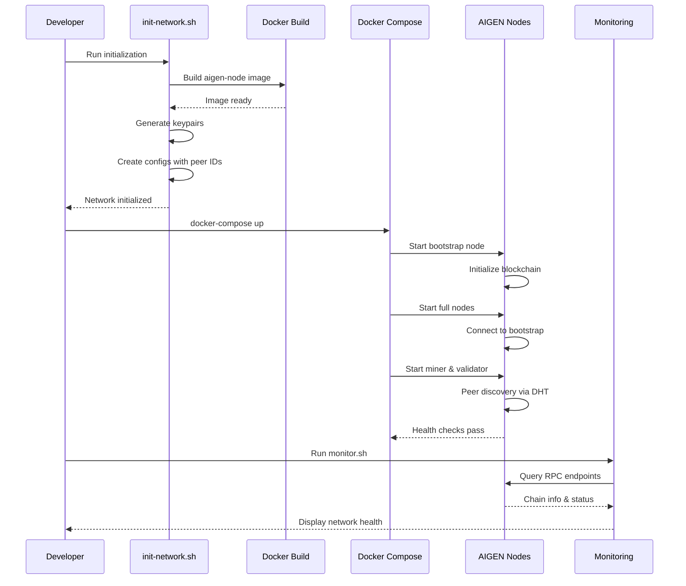

<!--
Copyright (c) 2025-present Cesar Saguier Antebi

This file is part of AIGEN Blockchain.

This source code is licensed under the Business Source License 1.1
found in the LICENSE file in the root directory of this source tree.
-->

# AIGEN Blockchain

AIGEN is an L1/L2 AI-native blockchain designed around a **Genesis CEO Key** that exercises immutable control over network safety. The CEO wallet and public key are hardcoded into the consensus layer and cannot be bypassed without recompiling the entire node binary.

## Quick Start (5 minutes)

Build:

```bash
cargo build --release
```

Test:

```bash
cargo test
```

Initialize a node:

```bash
aigen-node init --node-id my-node
```

Start the node:

```bash
aigen-node start
```

Test RPC (`getChainInfo`):

```bash
curl -s -X POST http://localhost:9944 \
  -H 'content-type: application/json' \
  -d '{"jsonrpc":"2.0","id":1,"method":"getChainInfo","params":[]}'
```

## Setting Up Test Model

For development and testing, generate a test ONNX identity model:

```bash
cargo run --bin setup-test-model -- --model-id mistral-7b --data-dir ./data
```

This creates:
- `./data/models/mistral-7b/model.onnx` - Identity ONNX model
- `./data/models/mistral-7b/shards/` - Model shards
- `./data/models/mistral-7b/manifest.json` - Metadata for auto-registration

The node will automatically register the model on startup. See [SETUP.md](SETUP.md) for detailed instructions.

### Quick Start
- **[Complete Guide](GUIDE.md)** - Comprehensive setup, deployment, and usage guide
- **[Setup Guide](SETUP.md)** - Step-by-step model setup instructions
- **[Admin Dashboard](dashboard/README.md)** - Web-based management interface

### API & Development
- **[API Reference](docs/API.md)** - Complete RPC API documentation
- **[JavaScript SDK](docs/examples/javascript/README.md)** - JavaScript examples
- **[Python SDK](docs/examples/python/README.md)** - Python examples

### Operations & Deployment
- **[Production Guide](docs/PRODUCTION_GUIDE.md)** - Production deployment
- **[Testing Guide](docs/TESTING.md)** - Testing and validation
- **[Genesis Key Security](docs/GENESIS_KEY_SECURITY.md)** - Security model

### Specialized Topics
- **[Economic Tiers](docs/ECONOMIC_TIERS.md)** - Subscription tiers
- **[AI Models](docs/AI_MODELS.md)** - AI model management
- **[Phased Roadmap](docs/roadmap.md)** - 4-phase implementation plan (Foundation → Safety → Governance → Deploy)

## Constitutional Governance

AIGEN implements a **Constitutional Filtering System** based on 135 biblical principles that automatically reviews AI model outputs before deployment:

- **135 Biblical Principles** organized into 10 categories (Love & Compassion, Truth & Integrity, Peace & Non-Violence, etc.)
- **Automated Content Moderation** using regex pattern matching
- **Immutable Constitution** stored on IPFS with hash verification on-chain
- **CEO Override** maintains absolute authority while ensuring accountability

The constitution is integrated into the auto-approval pipeline:
1. Model outputs are scanned against all 135 principles
2. Violations result in automatic rejection
3. Clean outputs proceed to staker vote threshold check
4. CEO can manually override any decision with on-chain justification

See [docs/constitution.md](docs/constitution.md) for complete documentation.

## Critical Prime Directive

As specified in `spec.md`, the Genesis Key provides:

- Emergency kill switch
- Veto power over all System Improvement Proposals (SIPs)
- Administrative override for critical upgrades

These controls are **immutable by design** and enforced cryptographically in the `genesis` crate.

## Architecture Overview

| Crate | Purpose |
|------|---------|
| `genesis` | CEO control layer (wallet constants, signatures, shutdown, SIP veto) |
| `blockchain-core` | Blocks, transactions, chain state, and crypto primitives |
| `consensus` | Proof-of-Intelligence (PoI) consensus engine scaffolding |
| `network` | P2P networking and shutdown signal propagation |
| `node` | Node binary, CLI, and RPC server |
| `scripts` | CEO key management tools |

The L1 runs autonomously, but all critical changes and global shutdown are gated by the Genesis Key.

## Proof-of-Intelligence (PoI)

PoI is a consensus scheme where miners and validators prove useful AI/ML work instead of wasteful hashing. Inference verification now runs deterministically against ONNX models with a verification cache; model storage and cache sizing are configured via node settings and environment overrides.

## Tokenomics (High-Level)

- Fixed initial allocation in the Genesis block, controlled by the CEO wallet
- Incentives for AI workers that provide verifiable PoI proofs
- Governance via SIPs that **must** be CEO-approved before mainnet deployment

## Development Setup

Requirements:

- Rust (stable)
- Cargo

Build the workspace:

```bash
cargo build --release
```

Run tests:

```bash
cargo test
```

## Configuration

Example configs:

- `node/config.example.toml`
- `node/config.example.json`

Configuration precedence:

- defaults
- config file
- environment variables
- CLI flags

## Development Workflow

Run all tests:

```bash
cargo test
```

Run crate tests:

```bash
cargo test -p blockchain-core
```

Build release:

```bash
cargo build --release
```

Run node (workspace):

```bash
cargo run --release --bin node start
```

Format:

```bash
cargo fmt
```

Lint:

```bash
cargo clippy
```

## Docker Deployment

For local testing with a multi-node network:

```bash
# Initialize and start 5-node testnet
cd docker
./scripts/init-network.sh
./scripts/start-network.sh

# Monitor network health
./scripts/monitor.sh

# View logs
./scripts/logs.sh

# Stop network
./scripts/stop-network.sh
```

See `docker/README.md` for detailed documentation.

Production deployment guides:
- Docker: See `docker/PRODUCTION.md`
- Kubernetes: See `k8s/README.md` (future)
- Cloud providers: See `docs/PRODUCTION_GUIDE.md`

## Configuration Files Summary

| File | Purpose |
|------|---------|
| `Dockerfile` | Multi-stage build for node binary |
| `.dockerignore` | Exclude unnecessary files from build context |
| `docker-compose.yml` | 5-node testnet orchestration |
| `docker/configs/bootstrap.toml` | Bootstrap node configuration |
| `docker/configs/full-node.toml` | Full node template |
| `docker/configs/miner.toml` | Miner node configuration |
| `docker/configs/validator.toml` | Validator node configuration |
| `docker/scripts/init-network.sh` | Network initialization script |
| `docker/scripts/start-network.sh` | Start testnet script |
| `docker/scripts/stop-network.sh` | Stop testnet script |
| `docker/scripts/logs.sh` | Log viewing utility |
| `docker/scripts/monitor.sh` | Real-time network monitoring |
| `docker/README.md` | Docker deployment documentation |
| `docker/PRODUCTION.md` | Production deployment guide |

## Deployment Workflow

For operational guides beyond Docker, see `docs/PRODUCTION_GUIDE.md` and `docs/TESTING.md`.



## Security and Genesis Key

- CEO wallet: `0x0000000000000000000000000000000000000001`
- CEO public key: hardcoded Ed25519 key in `genesis/src/config.rs`
- Shutdown is implemented as a one-way global flag that, once set, halts all critical operations

See `docs/GENESIS_KEY_SECURITY.md` for key management, shutdown procedures, and threat model details.

## Warning

The Genesis CEO controls are **not optional**:

- All SIP deployments require a valid CEO signature
- Consensus and networking components must check the global shutdown flag
- Any attempt to remove or bypass these checks creates an incompatible fork

This repository is the canonical reference implementation of the AIGEN Genesis control layer.

## Community and Support

- Report issues by opening a GitHub issue with:
  - OS details
  - the command you ran
  - logs (redact secrets)
  - config snippets (redact secrets)
- Contributing guidelines: not yet formalized.
## License
 
 [](LICENSE)
 
 ### Business Source License 1.1
 
 - **Licensor**: Cesar Saguier Antebi
 - **Licensed Work**: AIGEN Blockchain
 - **Change Date**: February 3, 2030
 - **Change License**: GPL-3.0-or-later
 
 This software is licensed under the Business Source License 1.1 (BSL 1.1).
 
 #### Permissions
 You may use this work for **non-production** purposes, including:
 - Development and testing
 - Personal use and research
 - Non-commercial experimentation
 
 #### Restrictions
 **Production use is strictly prohibited** without a commercial license. "Production use" includes:
 - Running the software in a production environment
 - Using the software to provide commercial services (SaaS, MSP)
 - Distributing the software as part of a commercial product
 
 ### Commercial Use
 
 Commercial use of the Licensed Work requires an express written license from the Licensor. This includes any use in a production environment or for any commercial purpose.
 
 - **Consent Required**: You must obtain written permission from Cesar Saguier Antebi.
 - **Royalty Agreements**: Commercial licenses may require royalty payments or other terms as negotiated.
 
 ### How to Obtain a Commercial License
 
 To request a commercial license or for any licensing inquiries, please contact:
 
 **Cesar Saguier Antebi**
 
 Please refer to the [COPYRIGHT](COPYRIGHT) file for detailed commercial terms and the [LICENSE](LICENSE) file for the full text of the Business Source License 1.1.
 
 ### Additional Resources
 
 - [LICENSE](LICENSE) - Full text of the Business Source License 1.1
 - [COPYRIGHT](COPYRIGHT) - Commercial licensing terms and change date details
 - [NOTICE](NOTICE) - Third-party dependency attributions
