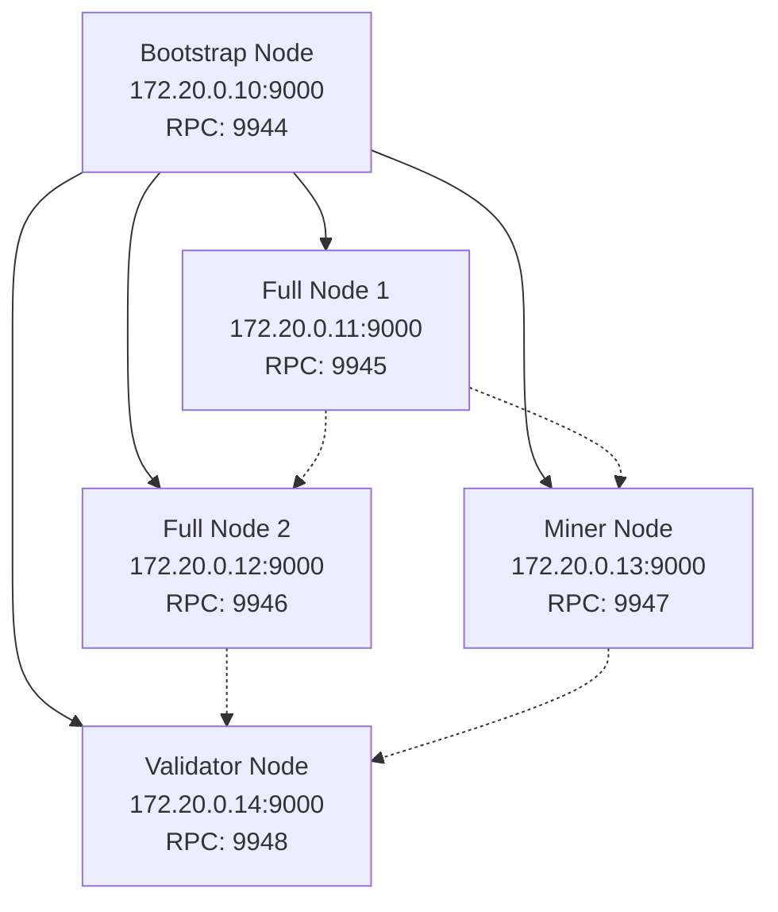

# Docker Testnet Deployment

## Prerequisites

- Docker 20.10+
- Docker Compose 2.0+
- 4GB RAM minimum
- 10GB disk space

## Quick Start

```bash
cd docker
./scripts/init-network.sh
./scripts/start-network.sh
./scripts/monitor.sh
```

## Network Topology Diagram



## Node Roles

- **Bootstrap**: Entry point for peer discovery, full blockchain sync
- **Full Nodes**: Complete blockchain validation and relay
- **Miner**: PoI proof submission and block production
- **Validator**: Block validation and consensus participation

## RPC Endpoints

- Bootstrap: `http://localhost:9944`
- Full Node 1: `http://localhost:9945`
- Full Node 2: `http://localhost:9946`
- Miner: `http://localhost:9947`
- Validator: `http://localhost:9948`

## Testing Examples

Get chain info:

```bash
curl -X POST http://localhost:9944 \
  -H "Content-Type: application/json" \
  -d '{"jsonrpc":"2.0","method":"getChainInfo","params":[],"id":1}'
```

Submit transaction:

```bash
curl -X POST http://localhost:9944 \
  -H "Content-Type: application/json" \
  -d '{"jsonrpc":"2.0","method":"submitTransaction","params":[{...}],"id":1}'
```

## Troubleshooting

- Nodes not connecting: Check bootstrap peer ID in configs
- Health checks failing: Increase start period in docker-compose.yml
- Port conflicts: Modify port mappings in docker-compose.yml
- Data corruption: Run `./scripts/stop-network.sh --clean` and reinitialize

## Configuration Customization

- Modify `docker/configs/*.toml` for node-specific settings
- Environment variables override config file values
- Restart required after config changes: `docker-compose restart {node}`

## Scaling the Network

- Add more nodes by duplicating service definitions
- Increment IP addresses and port mappings
- Update bootstrap peer lists
- Ensure unique `node_id` for each node
