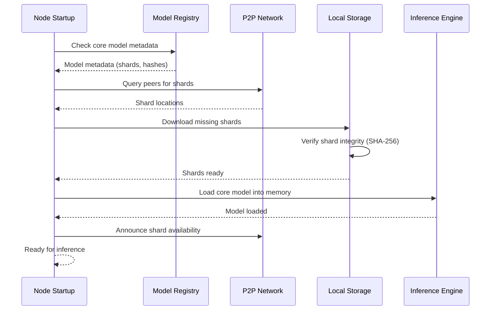

# AI Models

## Introduction

AIGEN provides a distributed AI model system with on-chain metadata and P2P shard distribution. Nodes load core models for worker roles and lazily load secondary models on demand.

## Supported Models

- Mistral-7B: general-purpose language model (~14GB), Basic tier or higher
- Llama2-13B: larger language model (~26GB), Pro tier required
- CodeGen-16B: code generation model (~32GB), Pro tier required

## Model Architecture

- Sharding into 4GB chunks
- IPFS and HTTP mirrors optional
- Target redundancy: 3x shard replication across nodes

## Model Registry

- Metadata includes model_id, version, total_size, shard_count, verification hashes
- Register via admin RPC or genesis configuration
- Core model designation controls preload priority on worker nodes

## Model Loading

- Lazy loading for non-core models
- LRU cache evicts least recently used models to respect memory limits
- Core models are pinned unless explicitly switched

## Model Sharding

- Shard structure identifies model_id, shard_index, total_shards, SHA-256 hash
- Integrity verification occurs after download and before registration
- Shard locations record node_id and backend type

## Storage Requirements

- Disk space proportional to model size
- Cache size recommendations:
  - Basic: 8GB
  - Pro: 16GB
  - Worker: 32GB+
- Redundancy overhead depends on network replication targets

## Model Management Operations

```bash
# List models
curl -s -X POST http://localhost:9944 -H 'content-type: application/json' \
  -d '{"jsonrpc":"2.0","id":1,"method":"listModels","params":[]}'

# Get model info
curl -s -X POST http://localhost:9944 -H 'content-type: application/json' \
  -d '{"jsonrpc":"2.0","id":2,"method":"getModelInfo","params":[{"model_id":"mistral-7b"}]}'

# Load model
curl -s -X POST http://localhost:9944 -H 'content-type: application/json' \
  -d '{"jsonrpc":"2.0","id":3,"method":"loadModel","params":[{"model_id":"llama2-13b"}]}'
```

```powershell
$body = @{jsonrpc="2.0";id=1;method="listModels";params=@()} | ConvertTo-Json
Invoke-RestMethod -Uri "http://localhost:9944" -Method POST -ContentType "application/json" -Body $body
```

```javascript
const res = await fetch("http://localhost:9944", {
  method: "POST",
  headers: {"content-type":"application/json"},
  body: JSON.stringify({jsonrpc:"2.0",id:1,method:"listModels",params:[]})
});
console.log(await res.json());
```

```python
import requests, json
rpc = "http://localhost:9944"
payload = {"jsonrpc":"2.0","id":1,"method":"getModelInfo","params":[{"model_id":"mistral-7b"}]}
print(requests.post(rpc, json=payload).json())
```

### Initialize with Core Model

```powershell
cargo run -p node --bin node -- init --model mistral-7b --role worker
```

## Model Switching

- Unload old core model
- Set new core model id in config
- Restart worker nodes to preload the new core model

## Troubleshooting

- Download failures: check peers, retry, verify network bandwidth
- Integrity errors: compare hashes, re-download shard
- Memory constraints: reduce cache size, limit concurrent models

## Sequence


