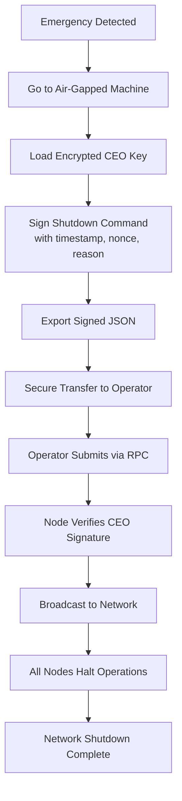

# CEO Operations Guide

## Table of Contents

- [Key Generation Workflow](#key-generation-workflow)
- [Emergency Shutdown Procedure](#emergency-shutdown-procedure)
- [SIP Approval / Veto Workflow](#sip-approval--veto-workflow)
- [Security Best Practices](#security-best-practices)
- [Diagrams](#diagrams)

## Key Generation Workflow

⚠️ **Do key generation on an air-gapped machine** whenever possible.

### Air-gapped machine setup recommendations

- Fresh OS install
- No network interfaces enabled
- Verified toolchain binaries (hash verification)
- Removable media for transferring only public artifacts

### Generate a CEO keypair

Run the `generate-ceo-keypair` script:

```bash
# See scripts/README.md for full usage
cargo run -p scripts --bin generate-ceo-keypair
```

What this does:

- Generates an Ed25519 keypair
- Encrypts the private key material (password-based)
- Prints or writes:
  - encrypted private key blob (store securely)
  - CEO public key (to be embedded into genesis)

### Understand the encrypted key format

- Encrypted key blob is intended to be stored at rest.
- The password must be strong and protected.

### Secure storage

Store separately:

- ✅ Public key (can be shared)
- ⚠️ Encrypted private key (restricted)
- ⚠️ Password (restricted, ideally split)

### Update the CEO public key in genesis

Update `genesis/src/config.rs` with the new public key.

✅ Then recompile and redeploy nodes:

```bash
cargo build --release
```

## Emergency Shutdown Procedure

### When to use emergency shutdown

Use shutdown only when:

- chain safety is compromised
- a critical vulnerability is detected
- you need an immediate network halt

### Prepare shutdown command offline

Message format:

```
shutdown:{network_magic}:{timestamp}:{nonce}:{reason}
```

- `network_magic`: identifies chain/network
- `timestamp`: unix timestamp
- `nonce`: unique value to prevent replay
- `reason`: short human-readable reason

`network_magic` is taken from the node’s config/genesis state and is **not** provided in the RPC request.

### Sign with `sign-shutdown-command`

```bash
# See scripts/README.md for full usage
cargo run -p scripts --bin sign-shutdown-command -- \
  --message "shutdown:..." \
  --key "./ceo-key.enc"
```

### Delivering to operators

- Export a signed JSON payload (timestamp, reason, nonce, signature)
- Transfer using a controlled channel (encrypted USB, courier, etc.)

### Broadcasting via `submitShutdown` RPC

Operators submit to a node RPC endpoint:

```bash
curl -s -X POST http://localhost:9944 \
  -H 'content-type: application/json' \
  -d '{"jsonrpc":"2.0","id":1,"method":"submitShutdown","params":[{"timestamp":1730000000,"reason":"...","nonce":1,"signature":"0x..."}]}'
```

### Verify shutdown propagation

- Query `health()` and/or chain endpoints.
- Check logs for shutdown flag activation.

### Recovery procedures

⚠️ Recovery requires a coordinated network restart / redeploy depending on your security posture.

## SIP Approval / Veto Workflow

### SIP proposal format and submission

SIP structure should include:

- `proposal_id`
- content
- intended activation rules

### Review SIP content offline

- Review on an air-gapped machine.
- Confirm no hidden changes.

### Compute proposal hash (SHA-256)

Example:

```bash
sha256sum sip.json
```

### Sign approval/veto

Approval message format:

The approval message bytes must match `SipProposal::message_to_sign_for_approval`.

Veto message format:

The veto message bytes must match `SipProposal::message_to_sign_for_veto`.

Sign with `sign-sip-approval` script:

```bash
cargo run -p scripts --bin sign-sip-approval -- \
  --message "sip_approve:123" \
  --key "./ceo-key.enc"
```

### Submit via RPC

Approve:

```bash
curl -s -X POST http://localhost:9944 -H 'content-type: application/json' \
  -d '{"jsonrpc":"2.0","id":1,"method":"approveSIP","params":[{"proposal_id":"123","signature":"0x..."}]}'
```

Veto:

```bash
curl -s -X POST http://localhost:9944 -H 'content-type: application/json' \
  -d '{"jsonrpc":"2.0","id":1,"method":"vetoSIP","params":[{"proposal_id":"123","signature":"0x..."}]}'
```

### Check status

```bash
curl -s -X POST http://localhost:9944 -H 'content-type: application/json' \
  -d '{"jsonrpc":"2.0","id":1,"method":"getSIPStatus","params":["123"]}'
```

### Deploying approved SIPs

- Implement changes in code
- Rebuild binaries
- Roll out nodes using a controlled upgrade process

## Security Best Practices

### Air-gapped requirements

- No internet
- Verified binaries
- Controlled physical access

### Password policy

- Minimum 16+ chars
- Use a password manager
- No password reuse

### Backup and recovery (Shamir Secret Sharing)

- Split the decryption secret
- Store shares in separate locations

### Key rotation (hard fork)

Key rotation requires:

- updating `genesis/src/config.rs`
- rebuilding and redeploying the entire network

### Operational security checklist

- ✅ Enforce least privilege
- ✅ Audit all CEO-signed messages
- ✅ Log and alert on invalid signature attempts
- ✅ Rotate operator credentials regularly

## Diagrams

### CEO Shutdown Workflow


