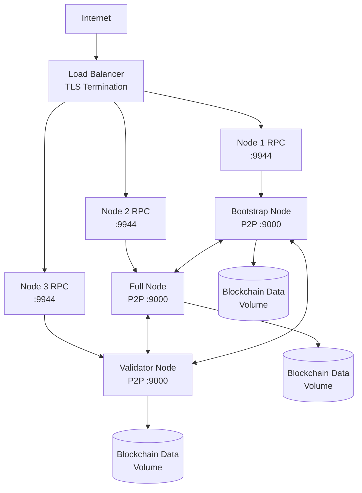

<!--
Copyright (c) 2025-present Cesar Saguier Antebi

This file is part of AIGEN Blockchain.

This source code is licensed under the Business Source License 1.1
found in the LICENSE file in the root directory of this source tree.
-->

# Cloud Deployment Guide

## Table of Contents

- [AWS Deployment](#aws-deployment)
- [DigitalOcean Deployment](#digitalocean-deployment)
- [Google Cloud Platform](#google-cloud-platform)
- [General Cloud Best Practices](#general-cloud-best-practices)
- [Deployment Architecture Diagram](#deployment-architecture-diagram)

## AWS Deployment

### EC2 instance setup

Recommended starting points:

- **Single node**: `t3.medium` or `t3.large`
- **Multi-node / validator**: `c6i.large` or `m6i.large`

Security groups (minimum):

- **P2P**: TCP `9000` (and additional ports if you run multiple nodes per host)
- **RPC**: TCP `9944` (prefer restricting to load balancer / VPN / your IP)
- **SSH**: TCP `22` (restrict to your IP)

### Install Docker on EC2

Use the official Docker installation steps for your AMI.

- Amazon Linux 2023 example:

```bash
sudo dnf update -y
sudo dnf install -y docker
sudo systemctl enable docker
sudo systemctl start docker
sudo usermod -aG docker ec2-user
```

### Single node deployment (Docker)

1. Build/pull your image.
2. Create a persistent data volume (EBS-backed storage recommended).
3. Run a container with:

- data directory mounted
- P2P and RPC ports exposed

⚠️ If you expose RPC publicly, place it behind a reverse proxy and TLS.

### Multi-node deployment (separate EC2 instances)

Recommended pattern:

- 1 bootstrap node (public P2P)
- N full nodes
- Optional validators/miners

Each node:

- Has its own data volume
- Exposes P2P to the internet (or VPC peering)
- Exposes RPC only to the load balancer (or private network)

### ECS / Fargate option

- Use **ECS EC2** when you need host networking or persistent storage patterns that are simpler than Fargate.
- Use **Fargate** for easier operations if you can model persistent storage appropriately.

For stateful blockchain nodes, ensure:

- stable storage
- predictable networking
- controlled rollouts

### Load balancer configuration for RPC

- Use an **ALB** for HTTP JSON-RPC.
- Terminate TLS at the ALB.
- Forward to node RPC targets on `:9944`.

### CloudWatch logging

- Ship container logs to CloudWatch Logs.
- Add metric filters for:

- “panic”
- “shutdown”
- “invalid signature”
- “peer disconnected”

### Backup strategy (EBS snapshots)

- Snapshot node EBS volumes regularly.
- For high assurance, stop the node (or ensure DB supports consistent snapshots) before snapshotting.

## DigitalOcean Deployment

### Droplet creation

Recommended sizes:

- **Single node**: 2 vCPU / 4GB RAM
- **Validator / multi-node**: 4 vCPU / 8GB RAM+

### Docker installation

Use DigitalOcean’s Docker marketplace image or install Docker manually.

### Single and multi-node deployment

- Same approach as AWS: one bootstrap node + N peers.
- Use private networking between droplets if available.

### Block storage for data persistence

- Attach a volume and mount it for the node data directory.
- Ensure correct permissions for the container user.

### Floating IP configuration

- Optionally attach Floating IP to the RPC load balancer / reverse proxy.

### Managed Kubernetes option

- Deploy nodes as StatefulSets.
- Use PersistentVolumeClaims for data.
- Expose RPC via Ingress with TLS.

### Monitoring

- Enable DigitalOcean metrics.
- Alert on CPU/memory/disk usage and RPC errors.

## Google Cloud Platform

### Compute Engine VM setup

- Start with `e2-standard-2` for a single node.
- Use larger instances for validators.

### Container-Optimized OS

Container-Optimized OS can simplify secure Docker operations.

### GKE option

- Run nodes as StatefulSets.
- Use a dedicated node pool.
- Expose RPC via an HTTPS load balancer.

### Load balancing and networking

- Keep P2P ports open to peers.
- Keep RPC behind TLS and access controls.

## General Cloud Best Practices

### Firewall rules

Minimum ports:

- P2P: `9000/tcp`
- RPC: `9944/tcp`

✅ Recommendation:

- Allow P2P from the internet.
- Restrict RPC to:

- load balancer
- VPN
- allowlisted IPs

### TLS / SSL termination (reverse proxy)

Example Nginx pattern:

- Terminate TLS
- Forward `/` to the node RPC

Example Traefik pattern:

- Use Let’s Encrypt
- Route to node containers by labels

### Domain / DNS

- Point `rpc.example.com` to your load balancer.
- Consider separate hostnames for different environments.

### Monitoring / alerting

Track:

- RPC latency and error rate
- peer count
- block production rate
- disk growth

### Backup / disaster recovery

- Periodic snapshots of data volume.
- Document restore process.
- Test restores regularly.

### Cost optimization
 
 - Use reserved instances/commitments for steady workloads.
 - Prefer fewer, larger nodes over many underutilized nodes.
 
 ## License Compliance for Production Deployment
 
 > **⚠️ IMPORTANT**: AIGEN Blockchain is licensed under the **Business Source License 1.1**.
 
 ### Production Use Definition
 In the context of cloud deployment, "Production Use" includes:
 - Running nodes that process real value or live traffic
 - Offering AIGEN Blockchain as a service (SaaS/BaaS)
 - Using the software to support any commercial business operation
 
 ### Commercial License Requirement
 **You must obtain a commercial license from Cesar Saguier Antebi before deploying to a production environment.**
 
 - See the [COPYRIGHT](../COPYRIGHT) file for commercial terms.
 - Contact the licensor to negotiate a commercial agreement.
 - Deployments for development, testing, and research (non-production) are permitted without a commercial license.
 
 **Automatic Termination**: Your license to use this software terminates automatically if you violate the production use restrictions.
 
 ## Deployment Architecture Diagram


