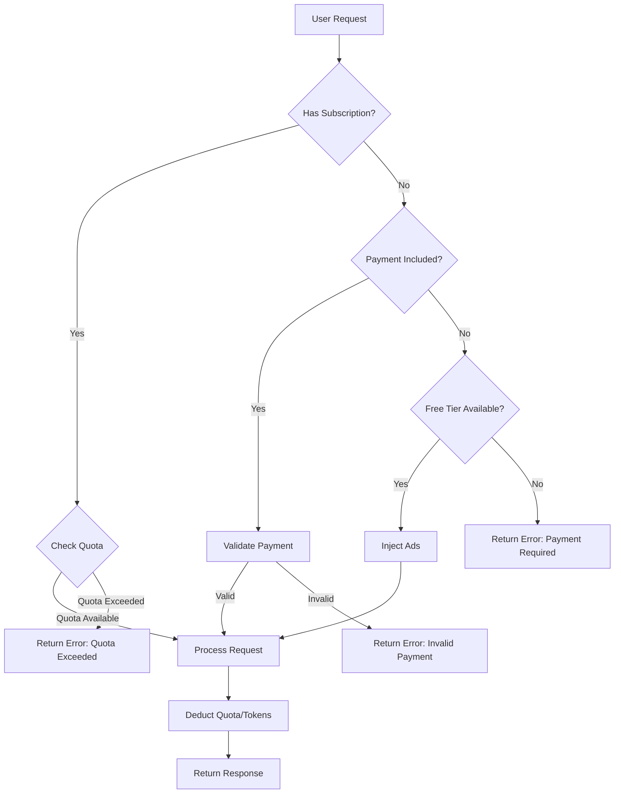

# Economic Tiers

## Introduction

AIGEN uses subscription-based access with optional pay-per-use for Unlimited tier. Tiers control quotas, features, model access, and context sizes.

## Tier Comparison

- Free: 10 requests/month, ad-supported, basic models only, 1K context
- Basic: 100 requests/month, 50 AIGEN, no ads, basic models, 4K context
- Pro: 1000 requests/month, 400 AIGEN, no ads, all models, 16K context
- Unlimited: Pay-per-use (1 AIGEN/1K tokens), volume discounts, all models, 32K context

## Batch Processing Tiers

- Standard: Immediate processing, 10 AIGEN per job
- Batch: 24-hour delay, 5 AIGEN per job (50% discount)
- Economy: 72-hour delay, 3 AIGEN per job (70% discount)

## Free Tier Details

- Ad injection for responses
- Rate limiting with wallet/IP tracking
- Lower queue priority and upgrade prompts

## Subscription Management

```bash
# Purchase Pro subscription (1 month)
curl -s -X POST http://localhost:9944 -H 'content-type: application/json' \
  -d '{"jsonrpc":"2.0","id":1,"method":"subscribeTier","params":[{"sender":"0x...","receiver":"0x...","amount":400,"timestamp":1730000000,"nonce":1,"priority":false,"chain_id":1,"payload":"{\"tier\":\"pro\",\"duration_months\":1,\"user_address\":\"0x...\"}"}]}'

# Check quota
curl -s -X POST http://localhost:9944 -H 'content-type: application/json' \
  -d '{"jsonrpc":"2.0","id":2,"method":"checkQuota","params":[]}'
```

## Payment Structure

- Token-based pricing with signed transactions
- Payloads embed subscription and batch request details
- Signature requirements: Ed25519 over tx_hash bytes

## Quota Tracking

- Monthly reset windows
- Usage tracked per user with rate limit decisions
- Quota exceeded returns error with retry time

## Upgrade Instructions

1. Check current tier and quota
2. Submit subscription purchase transaction
3. Verify activation and new limits

## Volume Discounts (Unlimited)

- >10K tokens: 10% off
- >100K tokens: 20% off
- >1M tokens: 30% off

## Examples

```powershell
$body = @{jsonrpc="2.0";id=1;method="getTierInfo";params=@()} | ConvertTo-Json
Invoke-RestMethod -Uri "http://localhost:9944" -Method POST -ContentType "application/json" -Body $body
```

```javascript
const res = await fetch("http://localhost:9944", {
  method: "POST",
  headers: {"content-type":"application/json"},
  body: JSON.stringify({jsonrpc:"2.0",id:1,method:"checkQuota",params:[]})
});
console.log(await res.json());
```

```python
import requests
payload = {"jsonrpc":"2.0","id":1,"method":"subscribeTier","params":[{"sender":"0x...","receiver":"0x...","amount":50,"timestamp":1730000000,"nonce":1,"priority":False,"chain_id":1,"payload":"{\"tier\":\"basic\",\"duration_months\":1,\"user_address\":\"0x...\"}"}]}
print(requests.post("http://localhost:9944", json=payload).json())
```

## Flow


