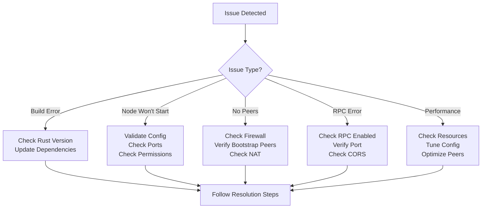

# Troubleshooting Guide

## Table of Contents

- [Build and Compilation Issues](#build-and-compilation-issues)
- [Node Startup Issues](#node-startup-issues)
- [Network Connectivity Issues](#network-connectivity-issues)
- [RPC API Issues](#rpc-api-issues)
- [Performance Issues](#performance-issues)
- [Docker-Specific Issues](#docker-specific-issues)
- [CEO Operations Issues](#ceo-operations-issues)
- [Troubleshooting Decision Tree](#troubleshooting-decision-tree)

## Build and Compilation Issues

### Rust version mismatch

- **Symptoms**: build fails, features not available, compiler errors referencing edition/features.
- **Root cause**: your `rustc` is too old/new for expected toolchain.
- **Resolution**:
  - Update Rust:

```bash
rustup update
rustup default stable
```

  - Rebuild:

```bash
cargo clean
cargo build --release
```

- **Prevention**:
  - Pin toolchain with `rust-toolchain.toml` (if/when added)

### Missing dependencies

- **Symptoms**: linker errors, missing system libs.
- **Root cause**: OS packages not installed.
- **Resolution**:
  - Install build essentials (Linux):

```bash
sudo apt-get update
sudo apt-get install -y build-essential pkg-config
```

### Compilation errors in specific crates

- **Symptoms**: `cargo test` fails in one workspace crate.
- **Resolution**:

```bash
cargo test -p blockchain-core
cargo test -p consensus
cargo test -p network
cargo test -p genesis
cargo test -p node
```

## Node Startup Issues

### Configuration validation errors

- **Symptoms**: node exits immediately with config parse/validation error.
- **Root cause**: invalid TOML/JSON values.
- **Resolution**:
  - Start with the example config:
    - `node/config.example.toml`
    - `node/config.example.json`
  - Validate ports, paths, and peer addresses.

### Port already in use

- **Symptoms**: bind error, “address already in use”.
- **Resolution**:
  - Change RPC and/or P2P port in the config.
  - Ensure no other node is running.

### Data directory permissions

- **Symptoms**: permission denied creating/reading DB.
- **Resolution**:
  - Ensure the user/container can read/write the data directory.

### Invalid genesis configuration

- **Symptoms**: chain fails to initialize or panics on startup.
- **Root cause**: inconsistent genesis settings or CEO key mismatch.
- **Resolution**:
  - Ensure all nodes use the same compiled binary/genesis.

## Network Connectivity Issues

### Nodes not discovering peers

- **Symptoms**: peer count stays at 0.
- **Root cause**: no bootstrap peers or P2P port blocked.
- **Resolution**:
  - Configure `bootstrap_peers`.
  - Open firewall for TCP `9000`.

### Bootstrap peer connection failures

- **Symptoms**: repeated dial failures in logs.
- **Resolution**:
  - Verify bootstrap address.
  - Confirm bootstrap node is listening and reachable.

### NAT traversal problems

- **Symptoms**: peers can’t connect from outside your LAN.
- **Resolution**:
  - Use port forwarding.
  - Prefer a public bootstrap node.

## RPC API Issues

### RPC server not starting

- **Symptoms**: node runs but no RPC listening.
- **Resolution**:
  - Verify RPC is enabled in config.
  - Verify `listen_addr` is not restricted incorrectly.

### Connection refused

- **Symptoms**: curl fails, browser can’t connect.
- **Root cause**: wrong port, firewall, or process not running.
- **Resolution**:
  - Confirm node is running.
  - Confirm RPC port `9944` is open.

### CORS errors (browser)

- **Symptoms**: browser fetch blocked.
- **Resolution**:
  - Enable CORS in node config (if supported).
  - Use a reverse proxy that sets CORS headers.

### Invalid request format

- **Symptoms**: JSON-RPC returns parse errors.
- **Resolution**:
  - Ensure JSON-RPC 2.0 fields exist: `jsonrpc`, `id`, `method`, `params`.

### CEO authentication failures

- **Symptoms**: CEO endpoints return invalid signature or unauthorized.
- **Root cause**: wrong message format, wrong network magic, replayed nonce, wrong key.
- **Resolution**:
  - Rebuild the message exactly as specified.
  - Ensure unique nonce.
  - Ensure CEO public key matches compiled genesis.

## Performance Issues

### High memory usage

- **Symptoms**: OOM, swapping.
- **Resolution**:
  - Increase RAM.
  - Reduce peer limits (if configurable).

### Slow sync speed

- **Symptoms**: height increases very slowly.
- **Resolution**:
  - Improve network connectivity.
  - Increase peer count.

### Transaction pool congestion

- **Symptoms**: pending tx grows.
- **Resolution**:
  - Increase resources.
  - Add nodes / improve propagation.

## Docker-Specific Issues

### Container startup failures

- **Symptoms**: container exits immediately.
- **Resolution**:
  - Check logs:

```bash
docker logs <container>
```

### Volume mount permissions

- **Symptoms**: permission denied writing DB.
- **Resolution**:
  - Fix ownership/permissions on host path.

### Network connectivity between containers

- **Symptoms**: peers can’t connect in compose.
- **Resolution**:
  - Ensure compose network is up.
  - Ensure ports are correctly mapped.

## CEO Operations Issues

### Key decryption failures

- **Symptoms**: signing scripts fail to decrypt.
- **Root cause**: wrong password or corrupted file.
- **Resolution**:
  - Verify password.
  - Validate backups.

### Invalid signature errors

- **Symptoms**: node rejects CEO request.
- **Resolution**:
  - Ensure exact message format.
  - Ensure correct key.

### Nonce replay errors

- **Symptoms**: node rejects as replay.
- **Resolution**:
  - Use a new nonce.
  - Ensure operators don’t submit the same signed payload twice.

### Network magic mismatch

- **Symptoms**: node rejects shutdown message.
- **Resolution**:
  - Ensure the correct `network_magic` value is used.

## Troubleshooting Decision Tree


